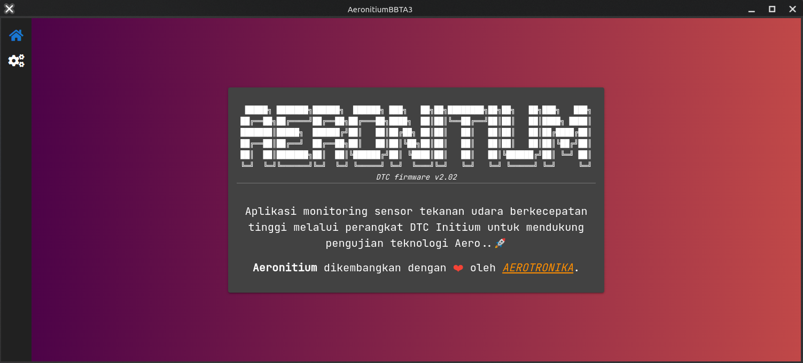

# Aeronitium BBTA3

```text
 █████╗ ███████╗██████╗  ██████╗ ███╗   ██╗██╗████████╗██╗██╗   ██╗███╗   ███╗
██╔══██╗██╔════╝██╔══██╗██╔═══██╗████╗  ██║██║╚══██╔══╝██║██║   ██║████╗ ████║
███████║█████╗  ██████╔╝██║   ██║██╔██╗ ██║██║   ██║   ██║██║   ██║██╔████╔██║
██╔══██║██╔══╝  ██╔══██╗██║   ██║██║╚██╗██║██║   ██║   ██║██║   ██║██║╚██╔╝██║
██║  ██║███████╗██║  ██║╚██████╔╝██║ ╚████║██║   ██║   ██║╚██████╔╝██║ ╚═╝ ██║
╚═╝  ╚═╝╚══════╝╚═╝  ╚═╝ ╚═════╝ ╚═╝  ╚═══╝╚═╝   ╚═╝   ╚═╝ ╚═════╝ ╚═╝     ╚═╝
```

Repositori pengembangan experimental aeronitium. Selama pengembangan dan penggunaan aplikasi perlu mempersiapkan
_Environment variables_ sebagai berikut:

```text
NATS_ADDRESS=127.0.0.1
APP_ADDRESS=0.0.0.0:8080
UI_ADDRESS=http://localhost:8080
DTC_ADDRESS=192.168.129.119:8400
```

Untuk mendapatkan rilis Aeronitium dapat melalui tautan berikut ini
[unduh](https://github.com/bbta3-bppt/aeronitium/releases/latest).


